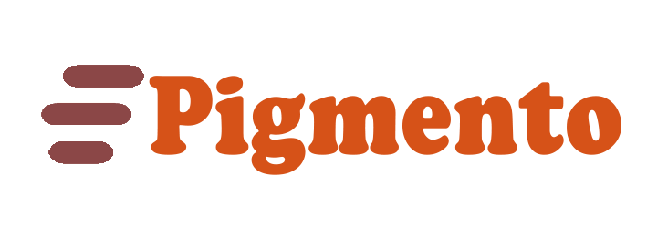

<p align="center">
<br>
<a href="http://mandujanokarol.github.io/JDK-/" target="_blank"></a>
<a href="http://jdkespacio.slack.com" target="_blank"></a>
</p>

# 

[](https://github.com/MandujanoKarol/JDK-) [](https://github.com/MandujanoKarol/JDK-) [](https://github.com/MandujanoKarol/JDK-) [](https://github.com/MandujanoKarol/JDK-) [](https://github.com/MandujanoKarol/JDK-)

## ¿Qué es Pigmento?
  
Pigmento es la aplicación que te permitirá conectarte con los mejores establecimientos de comida desde la comodidad de tu hogar. Te ofrece una gran variedad de menús con los que cuentan los establecimientos conectados a esta plataforma y así puedas pedir tus platillos favoritos cuando lo desees. 

Sitio Web:

```shell
https://mandujanokarol.github.io/JDK-/
```

## Visita nuestro sitio web

Entra! [website](https://mandujanokarol.github.io/JDK-/).

## Accessibility

Animate.css supports the [`prefers-reduced-motion` media query](https://webkit.org/blog/7551/responsive-design-for-motion/) so that users with motion sensitivity can opt out of animations. On supported platforms (currently all the majors browsers and OS), users can select "reduce motion" on their operating system preferences and it will turn off CSS transitions for them without any further work required.

## Core team 
<a href="https://github.com/MandujanoKarol" target="_blank"> 
 
</a>
<a href="https://github.com/Juancruzd" target="_blank"> 
  
</a>
<a href="https://github.com/duarteissc" target="_blank"> 

</a>

[Karol Quijas](https://github.com/MandujanoKarol) | [Juan de Dios](https://github.com/Juancruzd) | [Diego Duarte](https://github.com/duarteissc)
------------ | ------------- | -------------
FrontEnd Creator | BackEnd Creator | BackEnd Creator 

## License

Pigmento is licensed under the MIT license. <https://opensource.org/licenses/MIT>

## Contributing

By participating, you are expected to uphold this code. Please report unacceptable behavior to [jdk.teamgeo@gmail.com](mailto:jdk.teamgeo@gmail.com).


Pull requests are the way to go here. We only have two rules for submitting a pull request: match the naming convention (camelCase, categorised [fades, bounces, etc]) and let us see a demo of submitted animations in a [pen](https://codepen.io). That **last one is important**.

